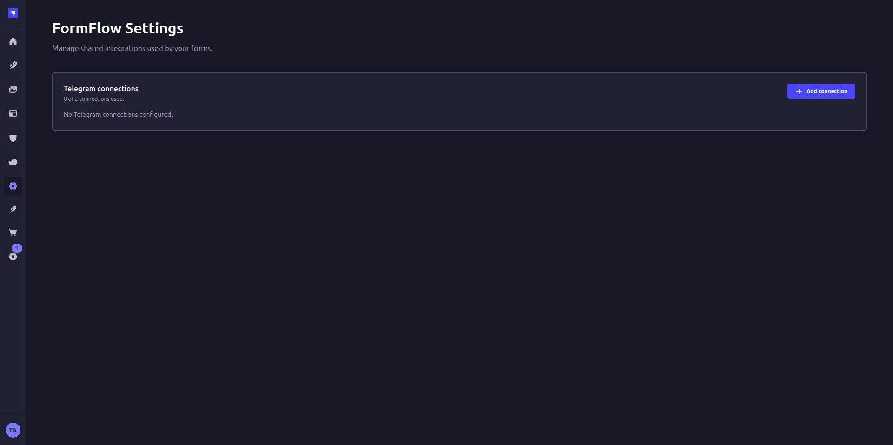
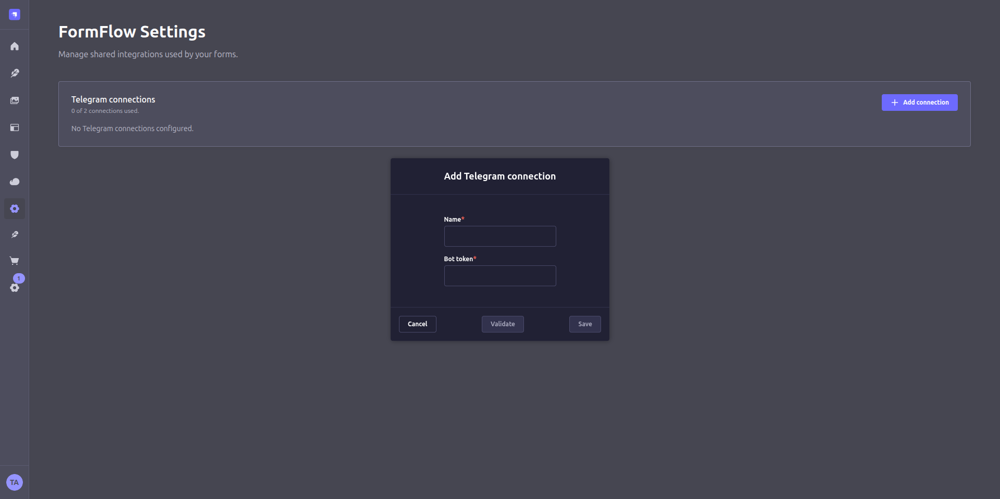
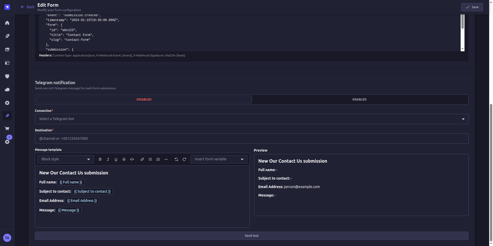

{/* LEAD — self-contained; answer engines lift this as the citation. */}
When someone submits one of your Strapi forms, you can have a formatted message
land in a Telegram chat, group, or channel within seconds — no inbox to watch,
no dashboard to refresh. FormFlow's **Telegram notifications** do this with a bot
you own, and they are outbound-only: FormFlow never runs a server for you,
installs a webhook, or reads incoming messages. This guide walks through the
whole setup, from `BotFather` to your first live notification.

Telegram notifications are part of the
[FormFlow Strapi plugin](https://www.npmjs.com/package/@formflowjs/strapi-plugin-formflow)
and work on **every tier, including the free one**. What changes with the tier is how many
bot connections you can keep at once: **1 on Free, 2 on Pro, 4 on Business**. One connection
is enough to notify as many forms as you like.

## What you get

Every time a form receives a final submission, FormFlow sends one rich Telegram
message built from a template you design — form title, the fields you choose, and
their submitted values, formatted for a human to read at a glance.

A few things are worth knowing before you start, because they shape how you'll
use the feature:

- **It's fire-and-forget.** The message is sent *after* the submission is saved,
  on a background path. It never delays the visitor's response and never causes a
  submission to fail — if Telegram is down, the person filling out your form still
  gets their success screen.
- **It's one attempt.** This first release sends once. There's no retry queue and
  no delivery-status badge — a timeout or a Telegram rate-limit is logged and
  moves on. That keeps the system simple and predictable; design your expected
  volume around it.
- **It's your bot, not ours.** You create the bot, you hold the token, and you
  decide where it posts. FormFlow stores your credential encrypted (or just the
  name of an environment variable) and reads it only on the server.

<Callout type="note">
Telegram bots can't start a conversation with a person. For a **private chat**,
the recipient has to message the bot or press **Start** first. Groups and
channels just need the bot added.
</Callout>

## Before you start

- [ ] A Strapi v5 project with the FormFlow plugin installed — the free tier is enough
- [ ] A Telegram account you can use to create a bot
- [ ] A destination in mind — a personal chat, a team group, or a channel

## Step 1 — Create and secure a bot

Open [@BotFather](https://t.me/BotFather) in Telegram, run `/newbot`, and follow
the prompts. When it finishes, it hands you a **Bot API token**. Copy it once and
treat it like a password — anyone holding it controls the bot.

You paste that token into FormFlow once. It is held in Strapi's own plugin store,
which is what lets you set the whole thing up from the admin panel without touching
a config file or redeploying — and what lets you rotate the token later without
editing a single form.

<Callout type="warning">
The token lives in your Strapi database, so **your database and its backups now
contain a credential**. Protect them the way you would any other secret store, and
keep the token out of source control, screenshots, and support tickets. If it ever
leaks, revoke it in BotFather, use **Replace token** in FormFlow Settings, and send
a fresh test.
</Callout>

## Step 2 — Choose a destination

FormFlow accepts either a numeric chat ID (including the negative IDs Telegram
uses for groups and channels) or a public `@username`. What the bot needs depends
on where you're sending:

| Destination     | What to do                                                      |
| --------------- | -------------------------------------------------------------- |
| Private chat    | The recipient messages the bot or presses **Start** first.     |
| Group           | Add the bot. Permission to send messages is enough.            |
| Channel         | Add the bot as an admin with permission to **post** messages.  |
| Public group/channel | Use its `@username` — it's the simplest destination.      |

Grant the *minimum* the destination requires. A channel bot needs to post; it
does not need to edit, delete, invite, or manage members.

### Finding the chat ID

Public groups and channels are easy — use the `@username`. Private chats and groups
have no username, only a numeric ID, and Telegram doesn't show it anywhere in the
interface.

The quickest way to find it: forward any message from that chat to
[@RawDataBot](https://t.me/RawDataBot). It replies with the raw JSON Telegram holds
for that message, and the ID you want is `forward_from_chat.id` (or `chat.id` if you
message the bot directly). Paste that number straight into FormFlow's **Destination**
field — including the leading `-` for groups and channels, which is part of the ID.

<Callout type="note">
`@RawDataBot` is a third-party utility, not something we run. Use it to read an ID
and then move on — don't forward anything sensitive to it.
</Callout>

## Step 3 — Add a FormFlow connection

In the Strapi admin, go to **FormFlow Settings → Telegram**. The panel shows how many
connections your licence allows and how many you've used.

<Steps>
  1. Click **Add connection** and give it a name you'll recognise later, plus the bot token from Step 1.
  2. Click **Validate**. FormFlow asks Telegram who the bot is and shows you the name and `@username` it got back, so you can catch a pasted-wrong token before saving.
  3. Save, then send the **connection test**. It uses fixed sample text and no real submission data, so it's safe to run anytime.
</Steps>

One connection is reusable across every form, so rotating a token or renaming the
connection never breaks the forms pointing at it. Extra connections are only for
genuinely separate bots — a second brand, or a client you keep isolated.

## Step 4 — Turn it on for a form

Open the form you want to wire up and go to its **Notifications → Telegram** tab.

<Steps>
  1. Select the connection and enter the destination from Step 2.
  2. Design the message in FormFlow's focused editor — headings, bold, lists, and an **Insert form variable** picker for your form's fields. You never touch raw HTML or Bot API JSON, and the preview beside it shows what will actually arrive.
  3. Send a test message to the real destination, then switch the toggle to **Enabled** and save the form.
</Steps>

Field variables reference **stable field IDs**, not labels — so renaming a field
in the builder keeps your template intact. Delete a field a template still uses,
and FormFlow shows a validation error instead of silently dropping in the wrong
value.

<Callout type="warning">
Every field value you put in the template leaves your Strapi installation and is
delivered to Telegram and everyone in the destination. Keep passwords, payment
details, tokens, and other sensitive fields out of the message. FormFlow flags
password fields, but data minimization is your call.
</Callout>

## What FormFlow deliberately doesn't do

Part of trusting a notification integration is knowing its boundaries. FormFlow's
Telegram support is outbound-only, on purpose:

- It never installs or deletes a webhook, so it won't fight with an interactive
  bot backend that shares the same token.
- It never reads incoming messages, commands, or updates.
- It never changes your bot's profile or administers your chats.

If a bot you also use interactively stops receiving updates, look at webhook
ownership elsewhere — FormFlow isn't touching it.

## Troubleshooting

A few things that trip people up on the first run:

- **"Chat not found."** Double-check the numeric ID or `@username`. For a private
  chat, confirm the recipient started the bot.
- **"Forbidden" or a permission error.** Re-add the bot, or grant it permission to
  send (group) or post (channel). Make sure it hasn't been blocked.
- **The test works, but real submissions don't notify.** Confirm the form is
  active, Telegram is enabled and saved, the connection is active for your
  license, and the event is a *new final submission* — draft saves and status
  changes intentionally don't fire.
- **Authentication error.** Rotate the token, and make sure the environment
  variable exists in the Strapi process — not just your shell — then restart.

## Wrap up

That's the whole loop: a bot from BotFather, a destination, one FormFlow
connection, and a per-form template. New submissions now show up in Telegram,
formatted and readable, without a server to babysit or a webhook to manage.

From here, point a second form at the same connection, or tailor each template to
the team that reads it. If you're still choosing how to model your forms, the
[FormFlow tutorials](/blog/tutorials) walk through the plugin feature by feature.
